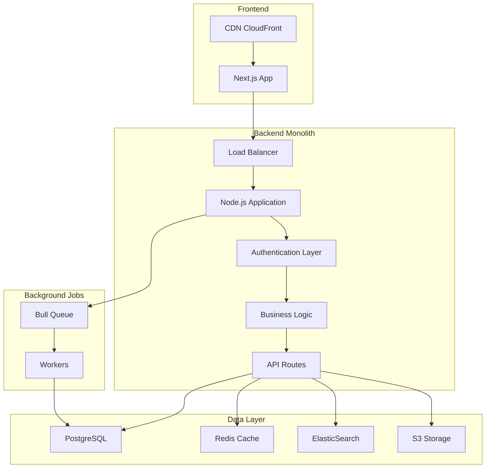

# Visão Geral da Arquitetura

O Portal do The News é construído com uma arquitetura monolítica moderna, otimizada para simplicidade, manutenibilidade e rápido desenvolvimento.

## Diagrama de Arquitetura

## Princípios de Design

### 1. Modularidade Interna
Código organizado em módulos bem definidos por domínio, mantendo separação de responsabilidades.

### 2. Camadas Bem Definidas
Separação clara entre apresentação, lógica de negócio e acesso a dados.

### 3. API-First
Todas as funcionalidades expostas através de APIs RESTful bem documentadas.

### 4. Escalabilidade Horizontal
Capacidade de escalar através de múltiplas instâncias da aplicação.

## Componentes Principais

<CardGroup cols={2}>
  <Card title="Frontend Layer" icon="browser">
    **Next.js + React**
    - Server-side rendering (SSR)
    - Static site generation (SSG)
    - Progressive Web App (PWA)
    - Otimização de SEO
  </Card>
  
  <Card title="API Gateway" icon="shield">
    **Kong Gateway**
    - Autenticação centralizada
    - Rate limiting
    - Request/Response transformation
    - Load balancing
  </Card>
  
  <Card title="Application Server" icon="server">
    **Node.js + Express**
    - Middleware pipeline
    - Error handling
    - Request validation
    - Response caching
  </Card>
  
  <Card title="Data Storage" icon="database">
    **Multi-Database Strategy**
    - PostgreSQL para dados transacionais
    - Redis para cache e sessions
    - ElasticSearch para busca full-text
    - S3 para arquivos e mídia
  </Card>
</CardGroup>

## Fluxo de Requisições

1. **Cliente → CDN**: Requisições estáticas servidas pelo CloudFront
2. **CDN → Frontend**: Requisições dinâmicas direcionadas ao Next.js
3. **Frontend → Load Balancer**: Chamadas API autenticadas via JWT
4. **Load Balancer → Application**: Distribuição de carga entre instâncias
5. **Application → Data Layer**: Operações de leitura/escrita
6. **Background Jobs**: Processamento assíncrono via filas

## Estratégias de Resiliência

### Circuit Breaker
Prevenção de cascata de falhas com Hystrix patterns.

### Retry com Backoff
Tentativas automáticas com delay exponencial.

### Bulkhead Pattern
Isolamento de recursos para prevenir esgotamento.

### Health Checks
Monitoramento contínuo da saúde dos serviços.

## Segurança

<Tabs>
  <Tab title="Autenticação">
    - NextAuth.js / Clerk
    - JWT tokens + refresh rotation
    - OAuth providers (Google, GitHub)
    - Session management via KV
  </Tab>
  
  <Tab title="Edge Security">
    - Cloudflare WAF
    - DDoS protection
    - Bot management
    - Rate limiting automático
  </Tab>
  
  <Tab title="Data Protection">
    - TLS 1.3 end-to-end
    - Database encryption at rest
    - Environment secrets
    - Content security policy (CSP)
  </Tab>
</Tabs>

## Observabilidade

### Analytics & Metrics
- **Cloudflare Web Analytics**: Real User Monitoring
- **Vercel Analytics**: Core Web Vitals
- **Custom events**: Business KPIs

### Error Monitoring
- **Sentry**: Error tracking e performance
- **Cloudflare Logpush**: Edge logs
- **Next.js telemetry**: Application metrics

### Performance
- **Core Web Vitals**: LCP, CLS, FID
- **Database insights**: Neon monitoring
- **Edge performance**: Cloudflare analytics

## Ambientes e Deploy

| Ambiente | URL | Branch | Deploy |
|----------|-----|--------|--------|
| Development | dev.portal.thenewscc.com.br | develop | Automático (push) |
| Preview | [hash].portal.pages.dev | feature/* | Automático (PR) |
| Production | portal.thenewscc.com.br | main | Automático (merge) |

## SLA e Performance

- **Uptime**: 99.95% (< 22 min downtime/mês)
- **Response Time P95**: < 200ms
- **Throughput**: 100k req/s
- **Error Rate**: < 0.1%